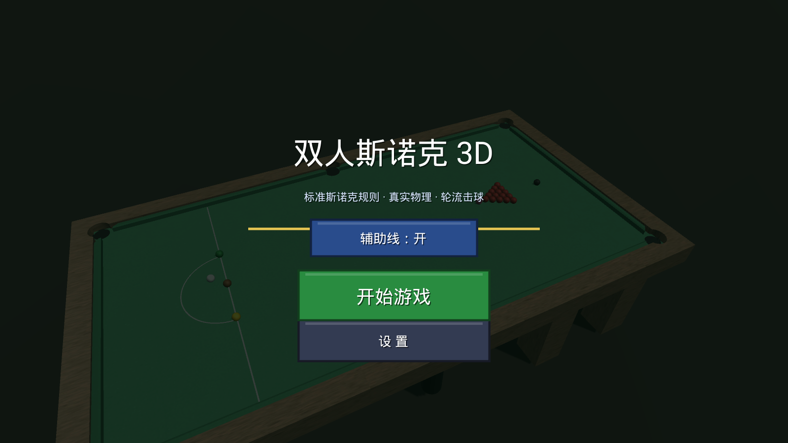
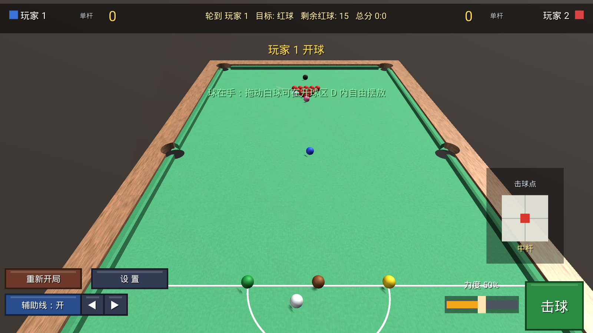
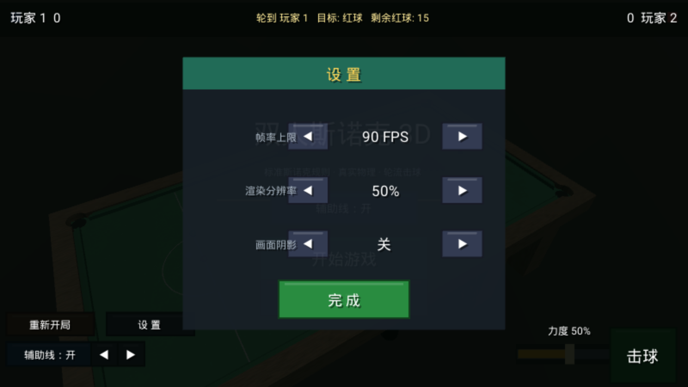
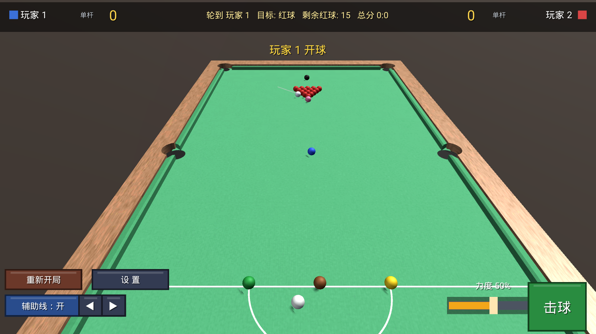
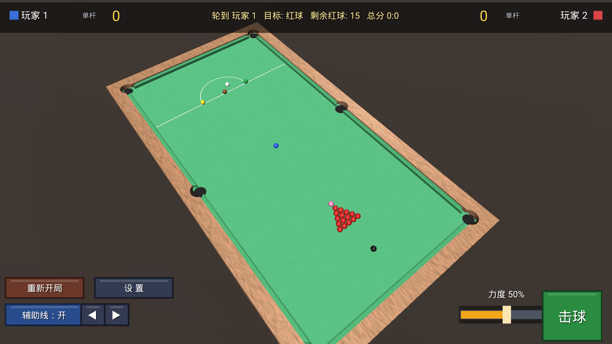
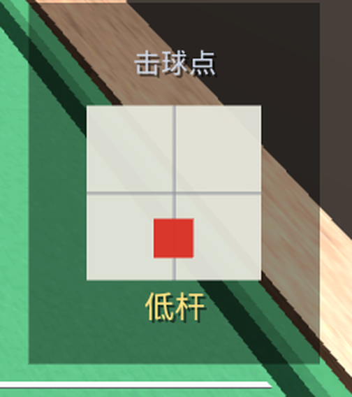
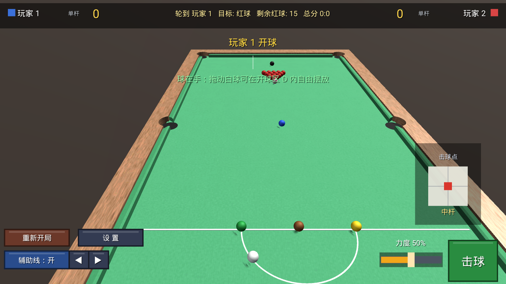

# MySnooker3D 🎱

**双人斯诺克 3D** —— 基于 Unity 的安卓双人同屏斯诺克游戏（当前为 Beta v0.36）。标准比赛尺寸球桌由 Blender
脚本化建模，真实物理（PhysX + 自定义滚动摩擦），**按 WPBSA 官方规则实现的斯诺克规则**
（红彩交替、清彩、彩球回点、罚分取值、只剩黑球时的终局判定），可开关辅助瞄准线，
内置入场运镜动画与设置界面（帧率 / 分辨率 / 阴影）。

*A 2-player split-screen snooker game for Android, built with Unity 2022.3 +
procedural Blender modeling. Realistic physics, full simplified snooker rules,
toggleable aiming aids, cinematic intro camera and in-game settings.*

## 📥 下载安装（Android）

[](https://github.com/laoye666-6/MySnooker3D/releases/latest)

- **直接下载** → **[Snooker3D.apk](https://github.com/laoye666-6/MySnooker3D/releases/download/v0.36/Snooker3D.apk)**（约 70MB）
- 或前往 [**Releases 页面**](https://github.com/laoye666-6/MySnooker3D/releases) 查看全部版本与更新说明
- **安装步骤**：下载 APK → 传到手机 → 点击安装；首次安装需在系统设置里允许「安装未知来源应用」
- **系统要求**：Android 7.0+；支持 arm64-v8a 真机与 x86_64 模拟器（MuMu 等）

> 💡 GitHub 仓库主页只能看到源码文件，安装包放在 **Releases**（右侧栏「Releases」也可进入）。
> 想从源码自行编译请见下文《从源码构建》。

| 主菜单 | 对局中 | 设置 |
|---|---|---|
|  |  |  |

| 记分板 HUD | 入场运镜 |
|---|---|
|  |  |

| 加塞击球点（v0.36） | 球在手·D 区摆球（v0.36） |
|---|---|
|  |  |

> 上排截图取自 v0.36 实机（MuMu）。**加塞击球点**：拖动圆盘内的小圆点选高杆/低杆/左右塞，
> 下方文字实时显示当前杆法。**球在手**：开球前与白球摔袋后，按住白球即可在开球区 D 内拖动摆放。

## ✨ 特性

- **真实物理**：2ms 物理步长（500Hz）+ 连续碰撞检测，球-球弹性 0.92、库边反弹、台呢滚动摩擦，
  低速撞库也能正常弹开；袋口捕获 + 出界兜底
- **加塞 / 杆法**（v0.36）：高杆（跟杆）、低杆（缩杆）、左右塞（吃库改角）。
  白球自旋使用自建的「滑动摩擦 + 自旋耦合」模型（PhysX 无法表达台球自旋）——
  跟杆推着球走、低杆把球拉回来都是模型自然涌现的结果；中杆与旧版手感完全一致
- **球在手**（v0.36）：开球前与白球摔袋后，白球可在开球区 **D 内自由拖动摆放**，
  位置自动夹取在 D 区内并与其它球分离
- **斯诺克规则（v0.34 起为完整规则，v0.35 补齐指定彩球/Miss/自由球）**：红/彩交替计分（1~7 分）；球 on 判定遵循官方
  Rule 10.3 —— 只要台面还有红球，**换手后接台方重新从红球打起**；最后一颗红球之后仍有一颗
  "任意彩球"；随后按分值升序清彩；犯规罚分取"球 on 分值 / 涉及球分值"较高者且最低 4 分
  （连续两杆打红为 7 分）；犯规杆一律不计分且彩球回点（多颗同时回点时高分优先）；
  只剩黑球时"第一次得分或犯规即终局"，仅当比分打平时重置黑球继续；
  单杆分实时显示；连续 5 套红黑弹出 147 满分提示
- **辅助瞄准线（可开关）**：幽灵球落点、目标球走向（按球色）、白球分离线、库边反弹预测
- **双人同屏**：轮流击球、实时记分板（单杆分 + 总分 + 目标球 + 剩余红球）
- **设置界面**：帧率四档（60/90/120/144）、渲染分辨率（50%/75%/100%）、阴影开关，
  滑入动画，PlayerPrefs 持久化
- **入场运镜**：贝塞尔弧线绕台飞行 + smootherstep 缓动 + 注视点时间平滑
- **全脚本化美术管线**：球桌/贴图/图标均由 Blender 无头脚本生成，改参数即可复现

## 🎮 操作

| 操作 | 方式 |
|---|---|
| 瞄准 | 桌面空白处左右拖动；或左下 ◀ ▶ 微调（每次 0.2°） |
| 力度 | 右下角滑条 |
| 击球 | 右下角"击球"按钮 |
| **加塞 / 杆法**（v0.36） | 右下角**「击球点」圆盘**：拖动盘内小圆点 —— 圆心=中杆、向上=高杆（跟杆）、向下=低杆（缩杆）、左右=左右塞（吃库改角） |
| **球在手摆放**（v0.36） | 开球前 / 白球摔袋后，**按住白球拖动**即可在开球区 **D 内**自由摆放；在台面别处按住拖动仍是转球杆 |
| 辅助线 | 左下"辅助线：开/关"切换 |

## 🛠 从源码构建

### 环境要求
- Unity **2022.3.62f3c1**（含 Android Build Support：SDK/NDK/OpenJDK）
- Blender 3.x+（仅重新生成模型/贴图时需要）
- 目标设备：Android 7.0+（真机 ARM64 或 x86_64 模拟器，如 MuMu）

### 步骤
1. 用 Unity Hub 打开 `UnityProject/`（首次导入会自动生成 Library，需数分钟）
2. 命令行构建 APK：
   ```bat
   "C:\Program Files\...\Unity.exe" -batchmode -quit -nographics ^
     -projectPath <本仓库>\UnityProject ^
     -executeMethod BuildGame.BuildAndroid -logFile build.log
   ```
   产物：`UnityProject\Builds\Snooker3D.apk`（调试可加 `-x86only` 只编 x86_64，IL2CPP 时间减半）
3. 或直接在 Unity 编辑器中 **File → Build Settings → Build**

### 重新生成美术资产（可选）
```bat
blender -b -P blender/make_table.py     :: 球桌模型（改尺寸/袋口参数）
blender -b -P blender/bake_cloth.py     :: 台呢+木纹贴图 + UV 重导出
blender -b -P blender/make_icon.py      :: 应用图标
```
产物在输出目录，拷入 `UnityProject/Assets/Resources/` 对应子目录即可。

> `tools/` 内的 sync.bat / m.bat 是开发期便捷脚本，**内含本机绝对路径**，克隆后请按
> 自己的环境修改。

## 📁 目录结构

```
├─ UnityProject/          # Unity 工程（Assets 含全部 C# 源码与资源，可直接打开）
│  └─ Assets/Scripts/     # 运行时代码（G/Bootstrapper/GameManager/... 全中文注释）
├─ blender/               # Blender 建模/烘贴图/图标脚本
├─ tools/                 # 开发期便捷脚本（需按本机路径修改）
└─ docs/screenshots/      # 截图
```

核心脚本一览：`G.cs`（常量）、`Bootstrapper.cs`（纯代码搭场景）、
`SnookerRules.cs`（**纯规则引擎，不依赖 Unity，可离线单测**）、
`GameManager.cs`（状态机 + 把规则结果落到物理与界面）、`BallController.cs`、`CueController.cs`、
`AimLine.cs`、`GameCamera.cs`、`UIManager.cs`、`GameSettings.cs`、
`Editor/BuildGame.cs`（命令行构建，含播放器设置读回校验）、
`Editor/PhysTest.cs`（离线物理回归）、`Editor/RuleTest.cs`（**离线规则回归，30 条断言**）。

## ⚠️ 已知坑（改代码前必读）

- 模拟器（MuMu）只认 arm64-v8a/x86_64，必须 IL2CPP；引擎代码裁剪必须关闭
  （`stripEngineCode = false` + `Assets/link.xml`），否则 SphereCollider 等被剥掉
- 白球不可与棕球同点重生（PhysX 会炸膛）；休眠刚体赋速度前必须 `WakeUp()`
- `ProjectSettings/DynamicsManager.asset` 的 `m_SimulationMode` 必须为 `0`——
  编辑器里跑过手动步进测试会把 Script 模式持久化，导致真机物理冻结
- 部分安卓机 uGUI 动态字体渲染空白 → 本项目文字全部走 IMGUI，中文用内嵌
  DroidSansFallback（Apache-2.0）
- **UI 双重缩放**：`CanvasScaler(match 0.5)` 的 scaleFactor 已等于 `K()`，若再给
  `RectTransform.anchoredPosition` 乘一次 `K()` 就是二次缩放 → 动画过程中底图与文字错位
- **HUD 别硬贴 1920×1080 边缘**：20:9 机型顶部会被裁、4:3 机型左右会被裁；用
  `Screen.safeArea` 夹进可见安全区（见 `UIManager.Fit` / `VisibleDesignRect`）
- **规则判定不要写在物理/UI 代码里**：v0.33 那个"清彩阶段犯规落袋导致一局永远打不完"的
  致命死局，正因为规则散落在 `GameManager` 中、只能上机真打才能发现；现在集中在纯函数
  `SnookerRules.cs` 并用 `RuleTest` 离线断言
- 更多细节见源码内中文注释

## 📝 更新记录

### v0.36 —— 球在手 D 区摆球 / 加塞杆法 / 物理步长 2ms
- **修复："球在手"时无法摆球**。旧版开球与白球落袋后，白球只能由代码放在开球线上的固定点，
  玩家**无法移动它**。现在开球前与白球摔袋后进入「球在手」状态，**直接按住白球即可在开球区
  D 内自由拖动摆放**（实时夹在 D 区内、自动与其它球分离重叠），摆好再瞄准出杆。
- **新增加塞 / 杆法**：右下角「击球点」圆盘，拖动盘内小圆点选择杆头打在白球上的位置 ——
  圆心中杆、向上**高杆（跟杆）**、向下**低杆（缩杆）**、左右**左右塞**（吃库改角）。
  物理上白球改用自建的"滑动摩擦 + 自旋耦合"模型（跟杆/低杆是模型自然涌现的结果，
  不是写死的动画），中杆与旧版手感完全一致。
- **物理步长 4ms → 2ms（500Hz）**：加塞的自旋修正更细腻，高速薄球碰撞更精确。
- **修复 v0.35 的回归**：关闭辅助线后幽灵球仍显示在台面上（看起来像多了一颗白球）。
- 新增离线物理回归 `PhysTest.SpinTest`：中杆/中低杆/低杆/高杆四档手感 + 侧塞数学断言，
  与规则回归 44 条一同在改动后自动验证。

### v0.35 —— 补齐剩余官方细则（指定彩球 / 犯规与未击到 / 自由球）
- **指定彩球 nomination（Rule 3(f)(i)(b)）**：球 on 为彩球时，击球方必须指定打哪一颗。
  本作用"辅助准线指向的彩球"自动作为指定对象，玩家无需额外点击；HUD 会显示
  「已指定 黑球」等提示。指定球参与罚分计算——例如指定黑球后白球落袋罚 **7 分**（旧版固定 4 分）。
- **犯规与未击到 Foul and a Miss（Rule 11(b)）**：未先击中球 on 且当时**未被斯诺克**时判 Miss。
  判 Miss 后屏幕下方弹出提示，接台方可以二选一：
  「**让对手重打**」→ 击球权交回犯规方、球位保持不动；
  「**我自己打**」→ 按当前球位正常击球。
- **自由球 Free Ball（Rule 12）**：犯规后若接台方对**所有球 on 都被斯诺克**（无直线击打线路），
  获得自由球资格——可指定任意一颗球当作球 on 打完这一杆：打进按**真实球 on 的分值**计分
  （例如真实球 on 是红球时，指定黑球打进只算 1 分），该球**回点**（红球也回点），
  之后按真实球 on 继续。
- **新增斯诺克几何判定** `GameManager.IsSnookered()`：对每颗球 on 取"中心 + 左右各一个球宽"
  三条路径做球-球遮挡检测，任一路径通畅即未被斯诺克（自由球与 Miss 共用）。
- **新增红球回点** `RespotRed()`：自由球规则下被打进的红球需回点，按官方做法放到粉球点附近空位。
- 规则回归测试从 30 条扩到 **44 条**（新增指定彩球 / 未指定罚分 / Miss 判定 / 自由球计分与回点等
  断言），44/44 通过。

### v0.34 —— 规则修正为完整斯诺克规则
- **修正核心规则错误**：进攻中断、换手后接台方**重新从红球打起**（Rule 10.3）。旧版换手后仍停留在
  "任意彩球"状态，对手可以直接合法打进彩球得分。
- **修正清彩阶段的致命死局**：旧版在清彩阶段"目标彩球与白球同杆落袋"（犯规）时，该彩球不回点、
  目标球又无法推进 → **这一局永远打不完**。现在犯规杆打进的彩球一律回点，清彩目标改为由台面
  剩余彩球实时推导。
- **罚分按 Rule 10 修正**：最低 4 分，取"球 on 分值 / 涉及球分值"较高者；空杆与白球落袋按
  球 on 分值计（只剩黑球时空杆罚 7 分，旧版固定 4 分）；连续两杆打红罚 7 分；同杆多犯规取最高。
- **只剩黑球按 Rule 4 修正**：第一次**得分或犯规**即终局（旧版只在黑球落袋时终局），
  仅当比分因此打平时重置黑球继续。
- 规则判定抽成纯函数 `SnookerRules.cs`，新增离线回归 `Editor/RuleTest.cs`（30 条断言，30/30 通过）。
- 修复：`PhysTest` 恢复物理设置未加 try/finally（异常会把 `SimulationMode:2` 写进工程并打进 APK，
  真机物理全冻）、`sync.bat` 只增不删导致 CS0101 构建失败、147 横幅与设置面板的 UI 双重缩放错位、
  HUD 在非 16:9 机型被裁、力度滑条右端被"击球"按钮盖住、HUD 画在菜单遮罩之上、
  VSync 使帧率四档失效、入场运镜两处衔接硬切、触屏瞄准中途中断、adb 脚本静默截出 0 字节截图。

### v0.33 —— 入场运镜重做
- 入场动画由直线插值改为三次贝塞尔弧线 + 五次 smootherstep 缓动 + 注视点时间平滑，时长 3.6s。

[更早版本见 Releases](https://github.com/laoye666-6/MySnooker3D/releases)

## 📄 许可证

本项目代码以 [MIT License](LICENSE) 开源。

第三方资产致谢：
- [DroidSansFallback.ttf](UnityProject/Assets/Resources/Fonts/) —— Apache-2.0（AOSP）
- NotoSansSC / NotoSansCJK（可选备用字体，未随仓库分发）—— SIL OFL 1.1
- Unity、Blender、MuMu 为各自所有者的商标
